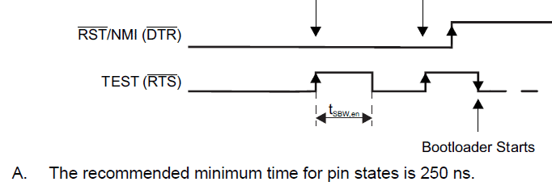
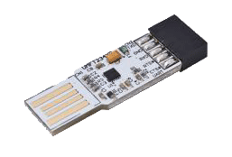
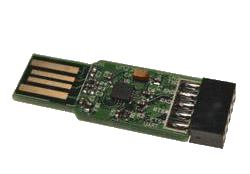

# msp430_kibsl

A little program I made to be able to program my MSP430 MCU out of the box, without needing any FET adapters or specific hardware - only USB to UART adapters.

> [!hot] It's only a few kilobytes 

## The invocation

To be able to interact with the MSP430 BootStrap Loader (BSL) on the UART bus via `TX` & `RX`, we must invoke the BSL by a special sequence on `#RST` & `TEST` pins.
Even though not officially supported on all models, the documentation writes about it by using `#DTR` & `#RTS` (they are both standard serial output signals that we can toggle manually) 



## Full USB to serial adapters

Technically, any USB to UART (Serial) adapter **with `#DTR` & `#RTS`** lines can do the job. A non-exhaustive list of the most common chips:

- tested
    - FTDI
        - FT232H - https://ftdichip.com/products/ft232hq/ - _my favorite as it supports SPI communication with many memory chips_
        - FT232R - https://ftdichip.com/products/ft232rq/
    - WCH (Jiangsu Qin Heng)
        - CH340K - https://www.wch.cn/products/CH340.html
        - CH343P - https://www.wch.cn/products/CH343.html
    - Silicon Labs
        - CP2102 - https://www.silabs.com/interface/usb-bridges/classic/device.cp2102
- not tested
    - Prolific
        - PL2303 - https://www.prolific.com.tw/US/ShowProduct.aspx?pcid=41
    - Microchip
        - MCP2200 - https://www.microchip.com/en-us/product/MCP2200
        - MCP2221A - https://www.microchip.com/en-us/product/MCP2221A

> [!tip] You can find many USB adapters with these chips for a few €/$ on AliExpress/Amazon

> [!warning] Check if your USB adapter supports the required I/O voltage (+3.3V) and provides pins for all necessary signals, especially #DTR
> Some adapter manufacturers do not make all chip signals available to the user

All of them can be used with the basic Windows API for communication: https://learn.microsoft.com/windows/win32/devio/communications-functions, especially with `EscapeCommFunction` to drive `#DTR` & `#RTS`.

### Wiring

| USB    | MSP430             |
|--------|--------------------|
| `3.3V` | `VCC`              |
| `TX`   | `RX`               |
| `RX`   | `TX`               |
| `#DTR` | `RST#/NMI/SBWTDIO` |
| `#RTS` | `TEST/SBWTCK`      |

### `msp430_kibsl` usage

In `msp430_kibsl`, you can use them out-of-the box with the integrated `serial` (default) driver, by specifying the COM port number on the command line

```
> msp430_kibsl /port:com17 /elf:st25tb_kiemul.out
[...]
Selected driver: serial
Using serial port: com17 (\\.\com17)...: OK
  0 | <ignored>
  1 | <ignored>
  2 | 0x8000 - 0xa92f ( 10544) ..........................................OK - CRC16 OK (4d1b)
[...]
```

## Basic USB adapters

But what if you have an adapter without `#DTR`? Or if you don't want to use `#DTR` & `#RTS` because they interfere with UART communication when not flashing?

### `UMFT234XD-01`
> https://ftdichip.com/products/umft234xd-01/ (based on https://ftdichip.com/products/ft234xd/ ) - CB0 available on chip & the adapter



| USB    | MSP430             |
|--------|--------------------|
| `3.3V` | `VCC`              |
| `TX`   | `RX`               |
| `RX`   | `TX`               |
| `CB0`  | `RST#/NMI/SBWTDIO` |
| `#RTS` | `TEST/SBWTCK`      |

> [!note] The driver used with `msp430_kibsl` is `ft234xd`

```
> msp430_kibsl /driver:ft234xd /elf:st25tb_kiemul.out
[...]
Selected driver: ft234xd
D2XX 3.2.16
| Port available @ COM36
| Manufacturer: FTDI (FT)
| Description : UMFT234XD
| SerialNumber: FTA4O6Q2

| CBUS configuration :
  CBUS0: 0x00 (TRISTATE) - KO, needed: 0x08 (IOMODE) -- will try to adjust it
| EEPROM program  : OK
| Cycle port      : OK
| Close old handle: OK
 -- wait 5s ... --
| Re-open device  : OK
| CBUS configuration :
  CBUS0: 0x08 (IOMODE) - OK
  0 | <ignored>
  1 | <ignored>
  2 | 0x8000 - 0xa92f ( 10544) ..........................................OK - CRC16 OK (4d1b)
[...]
```

### `UMFT230XB-01`
> https://ftdichip.com/products/umft230xb-01/ (based on https://ftdichip.com/products/ft230xq/ ) - CB0 & CB1 available on the adapter



| USB    | MSP430             |
|--------|--------------------|
| `3.3V` | `VCC`              |
| `TX`   | `RX`               |
| `RX`   | `TX`               |
| `CB0`  | `RST#/NMI/SBWTDIO` |
| `CB1`  | `TEST/SBWTCK`      |

> [!note] The driver used with `msp430_kibsl` is `umft230xb`

```
> msp430_kibsl /driver:umft230xb /elf:st25tb_kiemul.out
[...]
Selected driver: umft230xb
D2XX 3.2.16
| Port available @ D2XX Direct
| Manufacturer: FTDI (FT)
| Description : UMFT230XB
| SerialNumber: FTA2NHUZ

| CBUS configuration :
  CBUS0: 0x00 (TRISTATE) - KO, needed: 0x08 (IOMODE) -- will try to adjust it
  CBUS1: 0x00 (TRISTATE) - KO, needed: 0x08 (IOMODE) -- will try to adjust it
| EEPROM program  : OK
| Cycle port      : OK
| Close old handle: OK
 -- wait 5s ... --
| Re-open device  : OK
| CBUS configuration :
  CBUS0: 0x08 (IOMODE) - OK
  CBUS1: 0x08 (IOMODE) - OK
  0 | <ignored>
  1 | <ignored>
  2 | 0x8000 - 0xa92f ( 10544) ..........................................OK - CRC16 OK (4d1b)
[...]
```

> [!note] Received dongles were in `D2XX Direct` configuration, without a virtual COM port
> not important to interract with `msp430_kibsl`, but you may change its configuration with `FT Prog`

## References

- [Programmers and debuggers](Programmers%20and%20debuggers.md)
- https://www.ti.com/lit/pdf/slau550